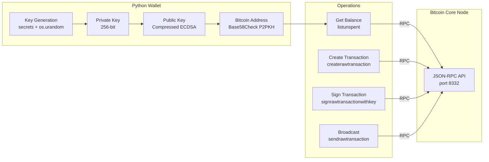
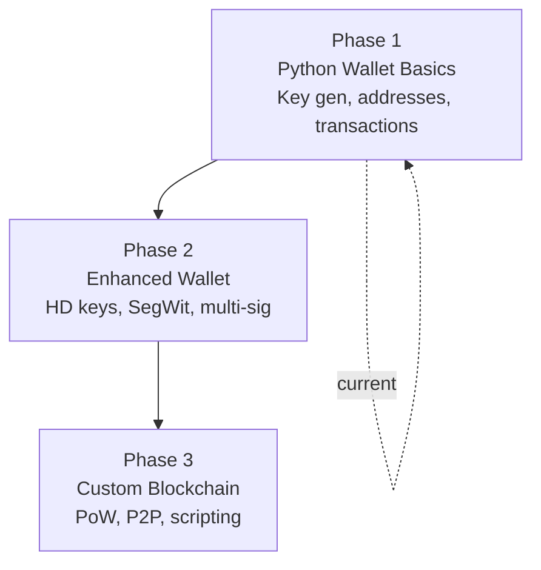

# Blockchain

A blockchain learning and research project focused on understanding cryptocurrency internals by studying Bitcoin Core and building Python implementations from scratch.

**This is an educational project.** The code here is for learning -- not for managing real funds.

---

## Project Structure

```
blockchain/
├── docs/                          # Project documentation
├── .claude/                       # AI assistant configuration
├── blockchain_dev/
│   ├── bitcoin_blockchain_dev/    # Full Bitcoin Core C++ clone (read-only reference)
│   └── bitcoin_wallet_dev/        # Active Python wallet development
│       └── bitcoin_wallet.py      # BitcoinWallet class
└── ...
```

### Two halves

1. **Bitcoin Core Reference** (`bitcoin_blockchain_dev/`) -- a complete clone of the Bitcoin Core source code. This is studied for understanding how Bitcoin actually works at the C++ level. It is never modified.

2. **Python Wallet** (`bitcoin_wallet_dev/`) -- a from-scratch Python implementation of Bitcoin wallet operations. This is the active development target.

---

## Architecture



---

## Phase Roadmap



| Phase | Focus | Status |
|---|---|---|
| **Phase 1** | Python wallet basics -- key generation, addresses, transactions | In progress |
| **Phase 2** | Enhanced wallet -- BIP-32/39/44 HD keys, SegWit, multi-sig, encryption | Planned |
| **Phase 3** | Custom blockchain -- PoW consensus, P2P, Merkle trees, scripting | Planned |

---

## How to Run

### Prerequisites
- Python 3.11+
- Bitcoin Core running with RPC enabled (for transaction operations)
- Python packages: `ecdsa`, `base58`, `python-bitcoinrpc`

### Running the wallet

```bash
cd blockchain_dev/bitcoin_wallet_dev
python bitcoin_wallet.py
```

This will:
1. Generate a new private key (or load from provided key)
2. Derive the compressed public key
3. Generate a Bitcoin address
4. Connect to Bitcoin Core via RPC
5. Display the wallet address and balance

### Bitcoin Core RPC setup

The wallet expects Bitcoin Core running locally with RPC enabled. Configure `bitcoin.conf`:

```ini
server=1
rpcuser=your_user
rpcpassword=your_password
rpcallowip=127.0.0.1
rpcport=8332
```

Or let the wallet auto-generate RPC credentials in `rpc_credentials.json`.

---

## Cryptographic Flow

The wallet implements the standard Bitcoin key-to-address derivation:

```
Private Key (256-bit random)
    |
    v
ECDSA secp256k1 point multiplication
    |
    v
Public Key (33-byte compressed, 02/03 prefix)
    |
    v
SHA-256
    |
    v
RIPEMD-160
    |
    v
Prepend network byte (0x00 for mainnet)
    |
    v
Double SHA-256 checksum (first 4 bytes)
    |
    v
Base58Check encode
    |
    v
Bitcoin Address (e.g., 1A1zP1eP5QGefi2DMPTfTL5SLmv7DivfNa)
```

---

## Key References in Bitcoin Core

For studying the C++ implementation alongside the Python wallet:

| Concept | Bitcoin Core File |
|---|---|
| Private keys | `src/key.cpp`, `src/key.h` |
| Public keys | `src/pubkey.cpp`, `src/pubkey.h` |
| Transaction scripts | `src/script/` |
| Wallet operations | `src/wallet/` |
| Consensus rules | `src/consensus/` |
| Block validation | `src/validation.cpp` |
| Mining | `src/miner.cpp` |
| P2P networking | `src/net.cpp` |

---

## Documentation

- `CLAUDE.md` -- AI assistant guidelines and project conventions
- `docs/BLOCKCHAIN_MASTER_PLAN.md` -- Full project plan with phases, architecture, and gate criteria
- `docs/status.md` -- Current project state
- `docs/versions.md` -- Version history