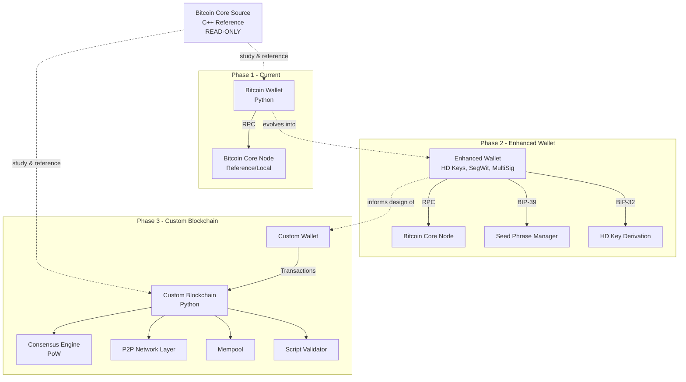
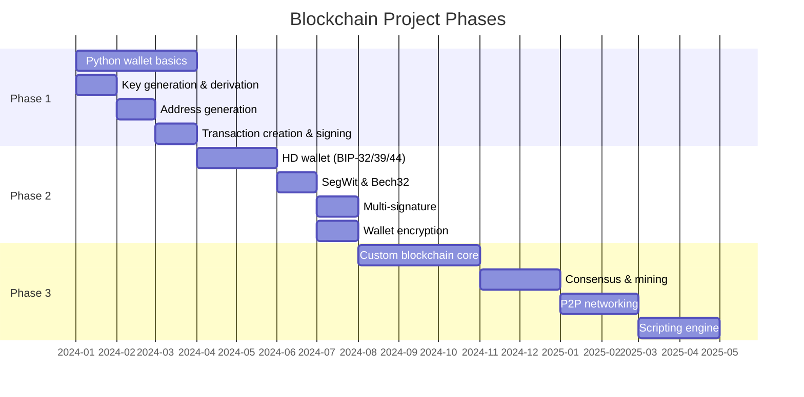
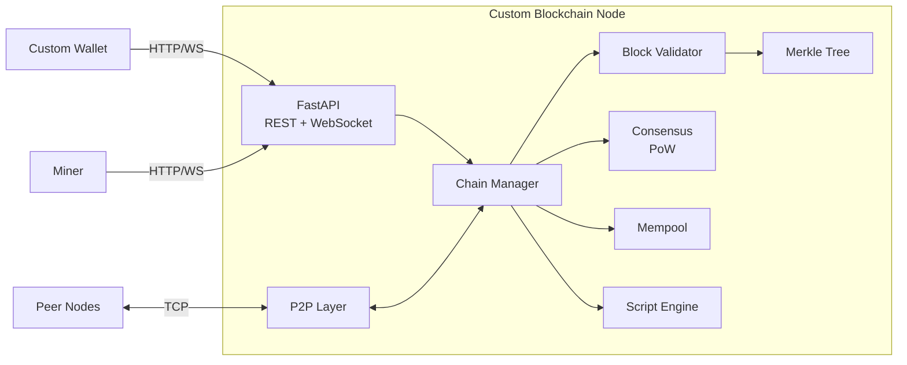

# Blockchain Master Plan

## 1. Project Vision

Build a deep, hands-on understanding of blockchain technology by:
1. Studying the Bitcoin Core C++ reference implementation
2. Building a Python Bitcoin wallet from scratch
3. Eventually implementing a simplified custom blockchain for educational purposes

This is a learning-by-building project. The goal is understanding, not production software.

---

## 2. Architecture Overview



---

## 3. Phase Roadmap



---

## 4. Phase 1: Python Wallet Basics

### Goals
- Understand ECDSA key pair generation on the secp256k1 curve
- Implement compressed public key derivation
- Generate valid Bitcoin addresses (P2PKH, Base58Check)
- Create, sign, and broadcast transactions via Bitcoin Core RPC
- Retrieve wallet balance via UTXO queries

### Current Implementation
The existing `bitcoin_wallet.py` implements a `BitcoinWallet` class with:
- `generate_private_key()` -- 256-bit key from mixed entropy sources
- `derive_public_key()` -- compressed ECDSA public key (secp256k1)
- `generate_address()` -- P2PKH address via SHA-256 + RIPEMD-160 + Base58Check
- `get_balance()` -- UTXO-based balance query via RPC
- `create_raw_transaction()` / `sign_transaction()` / `broadcast_transaction()` -- full tx lifecycle
- `create_and_send_transaction()` -- high-level send operation

### Remaining Phase 1 Tasks
1. Add `from __future__ import annotations` and full type annotations
2. Extract magic numbers to named constants (network byte `0x00`, fee `0.0001`)
3. Add docstrings to all methods
4. Create pytest test suite with known Bitcoin test vectors
5. Validate address generation against published test addresses
6. Add ruff configuration
7. Handle edge cases (zero balance, invalid addresses, RPC connection failures)

### Gate Criteria
- All functions typed and documented
- Test suite passes with 100% coverage on wallet logic
- ruff clean
- At least 3 known test vectors validated for key-to-address derivation

---

## 5. Phase 2: Enhanced Wallet with Key Management

### Goals
- Implement BIP-32 hierarchical deterministic key derivation
- Implement BIP-39 mnemonic seed phrases (12/24 words)
- Implement BIP-44 multi-account HD wallet structure
- Support SegWit transactions and Bech32 (bech32m) addresses
- Multi-signature transaction support (P2SH)
- Wallet encryption at rest (AES-256-GCM)
- Intelligent UTXO selection (coin selection algorithms)
- Transaction fee estimation via RPC `estimatesmartfee`

### Module Structure (planned)
```
blockchain_dev/bitcoin_wallet_dev/
├── src/
│   ├── __init__.py
│   ├── constants.py          # Network bytes, curve params, BIP constants
│   ├── keys/
│   │   ├── private_key.py    # Key generation
│   │   ├── public_key.py     # Derivation, compression
│   │   └── hd_key.py         # BIP-32 HD derivation
│   ├── address/
│   │   ├── base58.py         # P2PKH addresses
│   │   └── bech32.py         # SegWit addresses
│   ├── wallet/
│   │   ├── wallet.py         # Core wallet class
│   │   ├── seed.py           # BIP-39 mnemonic
│   │   └── encryption.py     # At-rest encryption
│   ├── transaction/
│   │   ├── builder.py        # Transaction construction
│   │   ├── signer.py         # Signing logic
│   │   └── coin_select.py    # UTXO selection algorithms
│   └── rpc/
│       └── client.py         # Bitcoin Core RPC wrapper
├── tests/
│   └── ... (mirrors src/)
└── pyproject.toml
```

### Key Dependencies Added in Phase 2
- `mnemonic` -- BIP-39 wordlist and checksum
- `bech32` -- Bech32/Bech32m encoding
- `cryptography` -- AES-256-GCM for wallet encryption

### Gate Criteria
- HD wallet generates correct addresses matching BIP-32 test vectors
- Mnemonic recovery produces identical wallet state
- SegWit addresses validate against BIP-173 test vectors
- Multi-sig transactions verifiable against Bitcoin Core `verifymessage`
- Wallet encryption round-trips without data loss
- 100% test coverage

---

## 6. Phase 3: Custom Blockchain Implementation

### Goals
Build a simplified blockchain from scratch (not a Bitcoin clone -- an educational implementation) to understand:
- Block structure and chain linking (hash pointers)
- Proof-of-work mining with adjustable difficulty
- Transaction validation via a simple scripting language
- Merkle tree construction and verification
- Mempool management and transaction relay
- Basic peer-to-peer networking
- Chain selection rules (longest valid chain)

### Architecture (planned)



### Gate Criteria
- Nodes can mine blocks with valid PoW
- Transactions propagate across peers
- Chain reorganization works correctly on fork
- Script engine validates P2PKH-style transactions
- Full pytest suite validates each component in isolation
- Integration test: 3-node network reaches consensus

---

## 7. Cross-Phase Concerns

### Cryptographic Primitives (shared across all phases)
| Primitive | Library | Usage |
|---|---|---|
| SHA-256 | `hashlib` | Address generation, block hashing, Merkle trees |
| RIPEMD-160 | `hashlib` | Address generation (Hash160 = RIPEMD160(SHA256(x))) |
| ECDSA secp256k1 | `ecdsa` | Key pairs, transaction signing |
| HMAC-SHA512 | `hashlib` / `hmac` | BIP-32 HD key derivation (Phase 2) |
| AES-256-GCM | `cryptography` | Wallet encryption (Phase 2) |
| Double-SHA256 | `hashlib` | Block header hashing (Phase 3) |

### Canonical Data Formats
- **Private keys:** 32 bytes, hex-encoded strings in Python
- **Public keys:** 33 bytes compressed (02/03 prefix), hex-encoded
- **Addresses:** Base58Check string (Phase 1), Bech32 string (Phase 2)
- **Transactions:** Bitcoin serialization format (for RPC compatibility)
- **Block headers:** 80 bytes (Phase 3, custom format inspired by Bitcoin)

### Security Non-Negotiables
- No custom cryptography -- only audited libraries
- No private key exposure in logs, errors, or serialized state
- Credentials (RPC, encryption keys) never committed to version control
- Entropy from `secrets` / `os.urandom` only -- never `random` alone for crypto

---

## 8. Technology Decisions

| Decision | Choice | Rationale |
|---|---|---|
| Language | Python 3.11+ | Educational clarity, rich crypto ecosystem |
| ECDSA library | `ecdsa` | Pure Python, well-audited, secp256k1 support |
| RPC client | `python-bitcoinrpc` | Standard Bitcoin Core RPC integration |
| Base58 | `base58` | Lightweight, correct implementation |
| Testing | `pytest` + `pytest-cov` | Standard, powerful parametrization |
| Linting | `ruff` | Fast, comprehensive, replaces black+flake8+isort |
| API (Phase 3) | FastAPI | Async, WebSocket, auto-docs |
| Blockchain reference | Bitcoin Core (C++) | The definitive implementation |