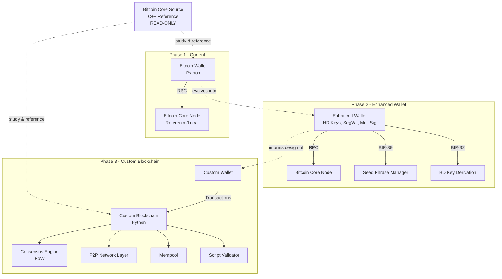
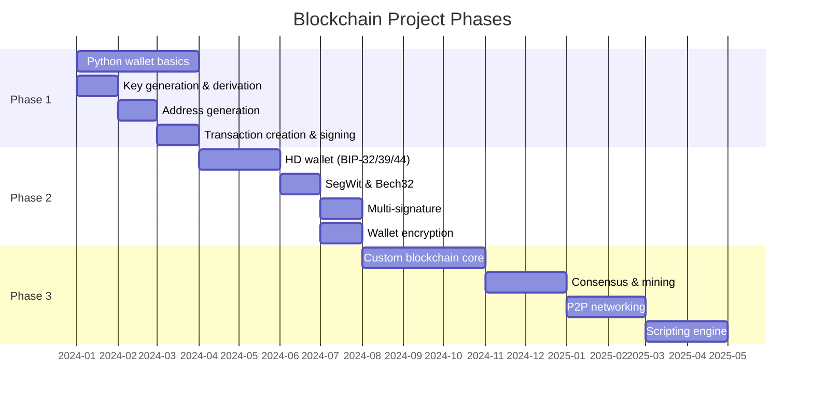
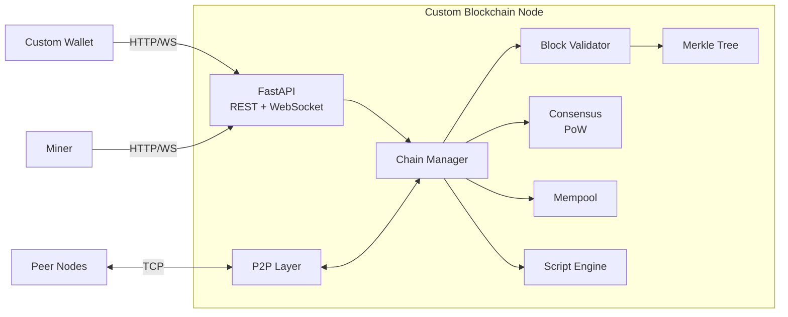
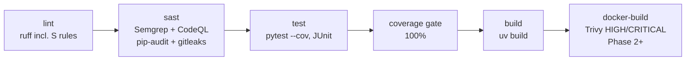

# Blockchain Master Plan

## 1. Project Vision

Build a deep, hands-on understanding of blockchain technology by:
1. Studying the Bitcoin Core C++ reference implementation
2. Building a Python Bitcoin wallet from scratch
3. Eventually implementing a simplified custom blockchain for educational purposes

This is a learning-by-building project. The goal is understanding, not production software.

---

## 2. Architecture Overview


```mermaid
graph TD
    subgraph "Phase 1 - Current"
        BW[Bitcoin Wallet<br/>Python]
        BW -->|RPC| BC[Bitcoin Core Node<br/>Reference/Local]
    end

    subgraph "Phase 2 - Enhanced Wallet"
        EW[Enhanced Wallet<br/>HD Keys, SegWit, MultiSig]
        EW -->|RPC| BC2[Bitcoin Core Node]
        EW -->|BIP-39| SEED[Seed Phrase Manager]
        EW -->|BIP-32| HD[HD Key Derivation]
    end

    subgraph "Phase 3 - Custom Blockchain"
        CB[Custom Blockchain<br/>Python]
        CB --> CONS[Consensus Engine<br/>PoW]
        CB --> P2P[P2P Network Layer]
        CB --> MEMPOOL[Mempool]
        CB --> SCRIPT[Script Validator]
        CW[Custom Wallet] -->|Transactions| CB
    end

    BW -.->|evolves into| EW
    EW -.->|informs design of| CW

    REF[Bitcoin Core Source<br/>C++ Reference<br/>READ-ONLY] -.->|study & reference| BW
    REF -.->|study & reference| CB
```

---

## 3. Phase Roadmap


```mermaid
gantt
    title Blockchain Project Phases
    dateFormat YYYY-MM
    axisFormat %Y-%m

    section Phase 1
    Python wallet basics           :p1, 2024-01, 3M
    Key generation & derivation    :p1a, 2024-01, 1M
    Address generation             :p1b, after p1a, 1M
    Transaction creation & signing :p1c, after p1b, 1M

    section Phase 2
    HD wallet (BIP-32/39/44)       :p2a, after p1, 2M
    SegWit & Bech32                :p2b, after p2a, 1M
    Multi-signature                :p2c, after p2b, 1M
    Wallet encryption              :p2d, after p2b, 1M

    section Phase 3
    Custom blockchain core         :p3a, after p2c, 3M
    Consensus & mining             :p3b, after p3a, 2M
    P2P networking                 :p3c, after p3b, 2M
    Scripting engine               :p3d, after p3c, 2M
```

---

## 4. Phase 1: Python Wallet Basics

### Goals
- Understand ECDSA key pair generation on the secp256k1 curve
- Implement compressed public key derivation
- Generate valid Bitcoin addresses (P2PKH, Base58Check)
- Create, sign, and broadcast transactions via Bitcoin Core RPC
- Retrieve wallet balance via UTXO queries

### Current Implementation
The existing `bitcoin_wallet.py` implements a `BitcoinWallet` class with:
- `generate_private_key()` -- 256-bit key from mixed entropy sources
- `derive_public_key()` -- compressed ECDSA public key (secp256k1)
- `generate_address()` -- P2PKH address via SHA-256 + RIPEMD-160 + Base58Check
- `get_balance()` -- UTXO-based balance query via RPC
- `create_raw_transaction()` / `sign_transaction()` / `broadcast_transaction()` -- full tx lifecycle
- `create_and_send_transaction()` -- high-level send operation

### Remaining Phase 1 Tasks
1. Add `from __future__ import annotations` and full type annotations
2. Extract magic numbers to named constants (network byte `0x00`, fee `0.0001`)
3. Add docstrings to all methods
4. Create pytest test suite with known Bitcoin test vectors
5. Validate address generation against published test addresses
6. Add ruff configuration
7. Handle edge cases (zero balance, invalid addresses, RPC connection failures)
8. ~~Wire `sast` stage in `.github/workflows/ci.yml`~~ -- DONE (CodeQL + Semgrep SARIF + gitleaks-action + `pip-audit`; ruff `S` in lint). Remaining: `test` job chained after `sast`; custom gitleaks 64-hex/WIF rule; Trivy in `docker-build` once a Dockerfile exists

### Gate Criteria
- All functions typed and documented
- Test suite passes with 100% coverage on wallet logic
- ruff clean
- At least 3 known test vectors validated for key-to-address derivation
- SAST stage green -- zero HIGH/CRITICAL findings; MEDIUM findings triaged with written justification
- New input boundaries in this phase are injection-safe and documented in `CLAUDE.md` `<security>`

---

## 5. Phase 2: Enhanced Wallet with Key Management

### Goals
- Implement BIP-32 hierarchical deterministic key derivation
- Implement BIP-39 mnemonic seed phrases (12/24 words)
- Implement BIP-44 multi-account HD wallet structure
- Support SegWit transactions and Bech32 (bech32m) addresses
- Multi-signature transaction support (P2SH)
- Wallet encryption at rest (AES-256-GCM)
- Intelligent UTXO selection (coin selection algorithms)
- Transaction fee estimation via RPC `estimatesmartfee`

### Module Structure (planned)
```
blockchain_dev/bitcoin_wallet_dev/
├── src/
│   ├── __init__.py
│   ├── constants.py          # Network bytes, curve params, BIP constants
│   ├── keys/
│   │   ├── private_key.py    # Key generation
│   │   ├── public_key.py     # Derivation, compression
│   │   └── hd_key.py         # BIP-32 HD derivation
│   ├── address/
│   │   ├── base58.py         # P2PKH addresses
│   │   └── bech32.py         # SegWit addresses
│   ├── wallet/
│   │   ├── wallet.py         # Core wallet class
│   │   ├── seed.py           # BIP-39 mnemonic
│   │   └── encryption.py     # At-rest encryption
│   ├── transaction/
│   │   ├── builder.py        # Transaction construction
│   │   ├── signer.py         # Signing logic
│   │   └── coin_select.py    # UTXO selection algorithms
│   └── rpc/
│       └── client.py         # Bitcoin Core RPC wrapper
├── tests/
│   └── ... (mirrors src/)
└── pyproject.toml
```

### Key Dependencies Added in Phase 2
- `mnemonic` -- BIP-39 wordlist and checksum
- `bech32` -- Bech32/Bech32m encoding
- `cryptography` -- AES-256-GCM for wallet encryption

### Gate Criteria
- HD wallet generates correct addresses matching BIP-32 test vectors
- Mnemonic recovery produces identical wallet state
- SegWit addresses validate against BIP-173 test vectors
- Multi-sig transactions verifiable against Bitcoin Core `verifymessage`
- Wallet encryption round-trips without data loss
- 100% test coverage
- SAST stage green -- zero HIGH/CRITICAL findings; MEDIUM findings triaged with written justification
- New input boundaries in this phase are injection-safe and documented in `CLAUDE.md` `<security>`

---

## 6. Phase 3: Custom Blockchain Implementation

### Goals
Build a simplified blockchain from scratch (not a Bitcoin clone -- an educational implementation) to understand:
- Block structure and chain linking (hash pointers)
- Proof-of-work mining with adjustable difficulty
- Transaction validation via a simple scripting language
- Merkle tree construction and verification
- Mempool management and transaction relay
- Basic peer-to-peer networking
- Chain selection rules (longest valid chain)

### Architecture (planned)


```mermaid
graph LR
    subgraph "Custom Blockchain Node"
        API[FastAPI<br/>REST + WebSocket] --> CHAIN[Chain Manager]
        CHAIN --> BLOCK[Block Validator]
        CHAIN --> CONS[Consensus<br/>PoW]
        CHAIN --> MEM[Mempool]
        CHAIN --> SCRIPT[Script Engine]
        BLOCK --> MERKLE[Merkle Tree]
        P2P[P2P Layer] <--> CHAIN
    end

    WALLET[Custom Wallet] -->|HTTP/WS| API
    MINER[Miner] -->|HTTP/WS| API
    PEER[Peer Nodes] <-->|TCP| P2P
```

### Gate Criteria
- Nodes can mine blocks with valid PoW
- Transactions propagate across peers
- Chain reorganization works correctly on fork
- Script engine validates P2PKH-style transactions
- Full pytest suite validates each component in isolation
- Integration test: 3-node network reaches consensus
- SAST stage green -- zero HIGH/CRITICAL findings; MEDIUM findings triaged with written justification
- New input boundaries in this phase are injection-safe and documented in `CLAUDE.md` `<security>`

---

## 7. Cross-Phase Concerns

### Cryptographic Primitives (shared across all phases)
| Primitive | Library | Usage |
|---|---|---|
| SHA-256 | `hashlib` | Address generation, block hashing, Merkle trees |
| RIPEMD-160 | `hashlib` | Address generation (Hash160 = RIPEMD160(SHA256(x))) |
| ECDSA secp256k1 | `ecdsa` | Key pairs, transaction signing |
| HMAC-SHA512 | `hashlib` / `hmac` | BIP-32 HD key derivation (Phase 2) |
| AES-256-GCM | `cryptography` | Wallet encryption (Phase 2) |
| Double-SHA256 | `hashlib` | Block header hashing (Phase 3) |

### Canonical Data Formats
- **Private keys:** 32 bytes, hex-encoded strings in Python
- **Public keys:** 33 bytes compressed (02/03 prefix), hex-encoded
- **Addresses:** Base58Check string (Phase 1), Bech32 string (Phase 2)
- **Transactions:** Bitcoin serialization format (for RPC compatibility)
- **Block headers:** 80 bytes (Phase 3, custom format inspired by Bitcoin)

### Security Non-Negotiables
- No custom cryptography -- only audited libraries
- No private key exposure in logs, errors, or serialized state
- Credentials (RPC, encryption keys) never committed to version control
- Entropy from `secrets` / `os.urandom` only -- never `random` alone for crypto

### Security -- SAST & Injection Safety (all phases)
Per global CLAUDE.md section 19; the project-level boundary inventory lives in `CLAUDE.md` `<security>` (section 9a) and is the source of truth -- this section summarizes, it does not duplicate.

**SAST is a mandatory pipeline stage from the first pipeline onward.** `.github/workflows/ci.yml` (GitHub Actions, public project) carries a `sast` job between `lint` and `test` in every phase; it fails on HIGH/CRITICAL, MEDIUM findings are triaged with a written justification. The `sast` job is wired today (`needs: [lint]`); `test` onward are not yet present.


```mermaid
flowchart LR
    LINT[lint<br/>ruff incl. S rules] --> SAST[sast<br/>Semgrep + CodeQL<br/>pip-audit + gitleaks]
    SAST --> TEST[test<br/>pytest --cov, JUnit]
    TEST --> COV[coverage gate<br/>100%]
    COV --> BUILD[build<br/>uv build]
    BUILD --> DOCKER[docker-build<br/>Trivy HIGH/CRITICAL<br/>Phase 2+]
```

Tool set as wired: Semgrep (`uvx semgrep scan`, `auto` + `p/owasp-top-ten` + `p/python`, severity ERROR) with SARIF upload to GitHub code scanning; CodeQL (`python`); ruff `S` family in `lint`; `uv run --with pip-audit pip-audit`; `gitleaks/gitleaks-action` (custom 64-hex / WIF private-key rule still pending); Trivy on the image once Phase 2 introduces a Dockerfile (pending -- no Dockerfile). The Bitcoin Core clone under `blockchain_dev/bitcoin_blockchain_dev/` is excluded from all scans (read-only reference, gitignored).

Injection-safety principles per component:
- **Wallet (Phase 1-2):** RPC credentials file is path-checked and schema-validated `json`, never `pickle`; credentials are percent-encoded into the RPC URL and host/port are constants; every JSON-RPC response (`listunspent`, raw-tx calls, `estimatesmartfee`) is validated by shape and bounds before arithmetic or re-submission; `recipient_address` is checksum-validated and `amount` is a bounded `Decimal` before any output map is built; errors go through structured logging with CR/LF stripped and never carry keys or passwords; entropy is `secrets`/`os.urandom` only (`S311`). Phase 2 adds mnemonic wordlist/checksum validation and authenticated (AES-256-GCM) decrypt of the wallet file before parsing.
- **Custom node (Phase 3):** FastAPI REST/WebSocket boundary uses Pydantic request models, body-size limits, pagination caps, and an explicit CORS allowlist; the P2P layer uses bounded message framing, max block/tx sizes, per-peer rate limits, and a typed wire schema (no generic deserialization); the script engine is an interpreter over an explicit opcode allowlist with op-count and stack-size limits -- never `eval`/`exec`.

---

## 8. Technology Decisions

| Decision | Choice | Rationale |
|---|---|---|
| Language | Python 3.11+ | Educational clarity, rich crypto ecosystem |
| ECDSA library | `ecdsa` | Pure Python, well-audited, secp256k1 support |
| RPC client | `python-bitcoinrpc` | Standard Bitcoin Core RPC integration |
| Base58 | `base58` | Lightweight, correct implementation |
| Testing | `pytest` + `pytest-cov` | Standard, powerful parametrization |
| Linting | `ruff` | Fast, comprehensive, replaces black+flake8+isort |
| API (Phase 3) | FastAPI | Async, WebSocket, auto-docs |
| Blockchain reference | Bitcoin Core (C++) | The definitive implementation |